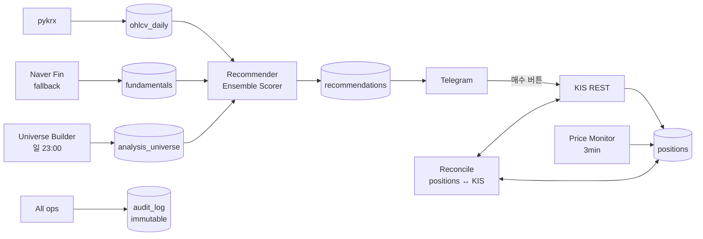

# 내일은 번트왕

> 텔레그램 기반 국내주식 자동 추천·실행 시스템.
> **외부 API 다중 통합 · 정합성 보장 · 단일 서버 운영 자동화** 사례 연구.
> 교육·연구 목적 · KIS 모의계좌 단일 사용자 운영.

---

## 무엇을 하는가

- 매 영업일 08:00, KRX 상위 500종목을 7각도(기술·재무·수급·뉴스·분봉·커뮤니티·유튜브)로 채점해 **상위 종목을 텔레그램으로 발송**
- 사용자는 **버튼 한 번**으로 KIS 증권사 API에 매수 주문 — 안전장치(시드 상한·집중 한도·연속 손실·PIN·장 시간 가드) 통과 시만 체결
- 장중 3분 간격 가격 모니터링 → 목표가·손절가 도달 시 즉시 알림
- **급변장(전일 코스피 급락) 대응** — 추천을 통째 보류하는 대신 "단타 전환"(번트 only·점수 바 상향·시드 축소)으로 발송해 침묵하지 않음
- 추천 외 임의 종목도 `/lookup <코드|이름>` 으로 7전문가 평가·뉴스·가상 TP/SL 즉석 조회 (정보 전용)
- 금요일 15:20 미청산 리마인더, 15:40 주간 회고 자동 발송
- 단일 운영자가 가비아 단일 서버에 systemd 로 24/7 무인 운영 중. 운영 중 P0 사고는 자체 진단·복구·재발방지 표준화 사이클로 처리 ([deep-dive](portfolio.md))

## Stack

`Python 3.12 · asyncio` · `python-telegram-bot[job-queue]` + `APScheduler` · `SQLite` (WAL) · `pykrx` + Naver Finance fallback · `KIS REST` · `holidays` (KR) · `pytest`. 가비아 단일 서버, `systemd` 배포.

## 아키텍처



핵심 설계 결정과 더 깊은 배경은 [`portfolio.md`](portfolio.md) 의 케이스 스터디 참조.

## 어려웠던 문제 — 외부 API 빈 응답을 휴장으로 오판해 추천 발송 누락 (P0)

**문제.** 영업일 자동 추천이 "KRX 휴장일"로 스킵. `_is_trading_day_cached` 가 `pykrx.get_market_ohlcv("005930")` 의 빈 DataFrame 을 휴장 단정. KRX HTTP 응답이 깨졌을 때 pykrx 가 예외 대신 빈 결과를 swallow → 정상 영업일이 휴장으로 둔갑.

**수정.** 캘린더 판정에서 외부 HTTP 의존 제거, `holidays.KR` 정적 데이터 우선.

```python
# After
@lru_cache(maxsize=10)
def _is_trading_day_cached(iso_date: str) -> bool:
    d = _date.fromisoformat(iso_date)
    if d.month == 12 and d.day == 31:           # KRX 연말 폐장 (holidays 미커버)
        return False
    try:
        import holidays
        if d in holidays.KR(years=d.year):
            return False
    except ImportError:
        log.warning("holidays 미설치 — 평일은 거래일로 간주")
    return True
```

같은 사이클에 universe builder 의 UNIQUE 충돌(`fundamentals_snapshot` 종목당 다중 snapshot)도 함께 fix — 두 P0 + 의존성 추가 + 누락 발송 복구까지 90분 안에 완료. 자세한 STAR 회고는 [`portfolio.md`](portfolio.md).

원칙으로 압축하자면:
- **캘린더성 판정에 외부 HTTP 의존 금지.** 정적 라이브러리 우선, 외부 호출은 보조.
- **트랜잭션 안전성: INSERT 전에 dedup**, UNIQUE 위반 가능 입력은 사전 검증.

## Operational Maturity

- **Immutable audit trail** — 추천·매수·매도·reconcile 모든 이벤트 `audit_log` 추가 전용
- **Reversible 정정 도구** — `scripts/reconcile_positions.py` 는 dry-run 기본, `--apply` 명시 시만 변경, audit 동반 기록
- **Config 노브** — `RECOMMEND_MIN_SCORE` · `AUTO_RECOMMEND_ENABLED` · `MARKET_DOWN_THRESHOLD_PCT` · `REGIME_DEGRADED_*`(급변장 단타 전환 on·점수·시드%) · `BALANCE_CACHE_TTL_SEC`(잔고 캐시 TTL) · 모드별 TP/SL — 코드 변경 없이 운영 조정
- **Backup + sync 검증 의무** — 운영 변경 시 `*.bak.YYYYMMDD` 보관, 로컬↔운영 diff + smoke test

## 실행

```bash
git clone <repo>
cd today_bunting_king
python -m venv .venv && source .venv/bin/activate   # Windows: .venv\Scripts\activate
pip install -r requirements.txt
cp .env.example .env                                 # 값 채우기
python -m src.universe.builder                       # analysis_universe 초기 빌드
python -m src.bot.telegram_bot                       # 봇 기동
```

자세한 운영 절차: [`USAGE.md`](USAGE.md)

## 다른 PC에서 작업하기 (멀티 PC)

코드는 GitHub(`origin/main`)에 동기화되어 있다. 비밀값·키는 git에 없으므로(`.gitignore`)
**수동으로 안전하게 옮겨야** 한다.

```bash
# 1. clone (private repo → GitHub 인증 필요: gh auth login 또는 PAT)
git clone https://github.com/bbang-bbang/today_bunting_king.git
cd today_bunting_king

# 2. Python 3.12 권장 (운영 서버 기준). venv + 의존성
python3.12 -m venv .venv && source .venv/bin/activate   # Windows: .venv\Scripts\activate
pip install -r requirements.txt
```

3. **비밀값 수동 이전** (git에 없음 — 기존 PC에서 안전하게 복사):
   - `.env` — 실제 토큰/키 채운 파일 (`.env.example`이 전체 키 목록)
   - `today-project.pem` — 가비아 서버 SSH 키 (서버 운영/DB 조회용)
   - USB·암호화 채널로 옮기고, 메신저·클라우드 평문 업로드 금지.

4. **작업 흐름**: 시작 시 `git pull`, 끝나면 `git push`. (로컬 main이 원격보다
   앞선 채 방치하면 다른 PC와 어긋난다 — 이번에 그 갭을 해소했으니 유지할 것.)

> DB(`data/bunting.db`)는 **운영 서버에만** 있다. 대부분의 분석/진단은
> `ssh -i today-project.pem rocky@1.201.126.200` 로 서버 DB에 직접 한다.
> 로컬 DB는 비어 있어도 코드 작업·테스트엔 지장 없다.

## 디렉터리

```
src/
  bot/         telegram_bot, scheduler (APScheduler 잡 정의)
  ensemble/    recommender, scorer (앙상블 채점)
  experts/     7각도 스코어링 모듈 (technical, fundamental, flow, news, ...)
  indicators/  지표 계산 + ohlcv 로더
  adapters/    KIS REST, market_data_pykrx
  crawlers/    pykrx · naver finance · news · youtube
  universe/    analysis_universe 빌더
  services/    portfolio · recommendation · audit · user
  risk/        RiskGuard · TP/SL 계산 · tick 정렬
  db/          SQLite connection · schema
scripts/       refresh_recommendations · reconcile_positions · push_recommend_now
tests/         pytest (asyncio)
```

## 면책

KIS 모의계좌(`TRADE_MODE=kis_mock`) 단일 사용자 운영을 가정합니다. 실거래(`live`) 사용 시 자기 책임. 코드·문서는 교육·연구 목적이며 투자 권유가 아닙니다.
