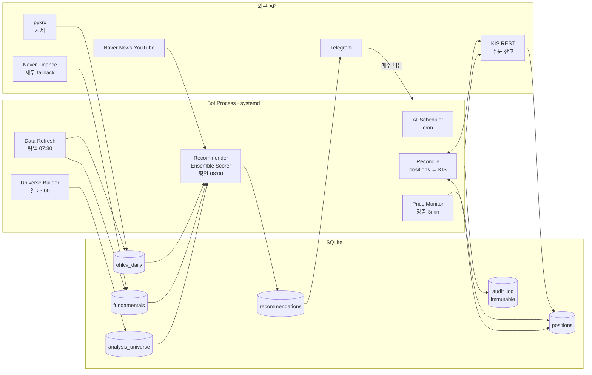

# 내일은 번트왕 — Engineering Portfolio

> Telegram 기반 국내주식 자동 추천·실행 시스템.
> **외부 API 다중 통합 · 실시간 정합성 보장 · 단일 서버 운영 자동화** 사례.

- **운영**: 가비아 단일 서버 (Rocky Linux + systemd), 1인 단독 설계·구현·운영
- **규모**: 매 영업일 500종목 분석 → 추천 발송 → KIS 주문 체결까지 무인 자동화
- **운영 기간 / 누적 추천·매수 건수**: _(채워주세요)_
- **저장소 / 데모 영상**: _(링크)_

---

## 1. System Design



**핵심 설계 결정**

| 결정 | 근거 |
|---|---|
| SQLite (서버 단일 파일) | 단일 운영자 / 단일 노드, 트랜잭션 단순. 동시 쓰기 부담 없음. PostgreSQL 도입 비용 > 가치 |
| APScheduler (in-process cron) | 외부 워커 큐 불필요. systemd 한 프로세스로 관리·재기동 용이 |
| pykrx + Naver fallback | KRX 인증 게이팅 우회. 단일 소스 장애 시 추천 다양성 유지 |
| audit_log immutable + reconcile 스크립트 | "DB 기록"과 "증권사 잔고"가 어긋나는 정합성 사고를 사후 진단 가능하게 |
| dry-run / `--apply` 두 단계 패턴 | 정합성 정정·ghost 정리 등 위험 작업의 reversibility 확보 |

---

## 2. Engineering Case Studies

### Case 1 — 부분체결 오인식으로 매도 6회 거부 (P0)

**Situation.** KIS 모의 매수 100주가 부분체결로 잔고에 즉시 안 잡히는 경우, 봇이 "잔고 fallback"으로 broker_orders 내 다른 lot(54주)을 그대로 받아 매수 수량으로 인식. 이후 매도 시도가 KIS에 의해 6회 cancelled (실제 보유와 매도 수량 불일치).

**Task.** 잘못 기록된 매수 lot 정정 + 부분체결 인식 로직 강화 + 좀비 매도 ghost 정리.

**Action.**
1. KIS 잔고를 단일 진실 소스로 재선언("잔고가 진실"). DB 기록은 잔고에 종속.
2. `job_buy_partial_recheck` 신규 — 부분체결 의심 lot 을 KIS 잔고로 재검증, 시간차 동기화 후 보정.
3. 좀비 매도 lot 은 reconcile 스크립트로 ghost 처리(`status=closed, pnl=NULL`) — `pnl=0` 으로 두면 통계가 오염되므로 NULL 로 손익 미집계.
4. 동일 패턴 사고 진단을 위한 reconcile 스크립트 표준화 (`scripts/reconcile_positions.py`, dry-run 기본 / `--apply` 명시 시만 변경).

**Result.** 같은 날 P0 fix 배포. 이후 매도 cancelled 0건. 정합성 진단이 5분 안에 가능해짐 (잔고/DB 매칭 + ghost/orphan 분리 출력).

**Takeaway.** 분산 시스템 정합성에서 **신뢰의 출처를 단일화**하고, 자동 정정 도구를 "dry-run + audit 동반"으로 만들면 다음 사고에서 복구 시간이 한 자릿수 분으로 줄어든다.

---

### Case 2 — 외부 API 빈 응답을 휴장으로 오판해 추천 발송 누락 (P0)

**Situation.** 영업일 5/7 08:00 자동 추천 발송이 "KRX 휴장일 — 추천 발송 생략"으로 스킵. 동시에 분석 유니버스 테이블이 1종목으로 깨짐.

**Diagnosis.** 두 개의 독립 P0:

1. **`_is_trading_day_cached` 가 외부 HTTP 응답에 의존.** pykrx `get_market_ohlcv("005930")` 의 빈 DataFrame 을 휴장으로 단정. KRX HTTP 응답이 깨졌을 때 (가비아의 인증 미가입 + KRX 사이트 불안정) pykrx 가 예외 대신 빈 결과를 swallow → 정상 영업일이 휴장으로 둔갑.

2. **Universe builder UNIQUE 충돌.** `fundamentals_snapshot` 이 (code, snapshot_date) 키로 종목당 다중 행. 시총 top 500 쿼리가 같은 code 중복 반환 → `executemany INSERT` 시 UNIQUE 위반 → DELETE 만 일부 적용된 상태로 트랜잭션 깨짐 → universe 1종목.

**Action.**

```python
# Before — pykrx 응답에 직접 의존
@lru_cache(maxsize=10)
def _is_trading_day_cached(iso_date: str) -> bool:
    try:
        df = _krx.get_market_ohlcv(date_str, date_str, "005930")
        return not df.empty                      # 빈 DF = 휴장? 또는 KRX 장애?
    except Exception:
        return True

# After — 정적 데이터 우선, 외부 호출 제거
@lru_cache(maxsize=10)
def _is_trading_day_cached(iso_date: str) -> bool:
    d = _date.fromisoformat(iso_date)
    if d.month == 12 and d.day == 31:           # KRX 연말 폐장 (holidays 미커버)
        return False
    try:
        import holidays
        if d in holidays.KR(years=d.year):
            return False
    except ImportError:
        log.warning("holidays 미설치 — 평일은 거래일로 간주")
    return True
```

```python
# Before — 종목당 다중 snapshot 으로 인한 중복
cap_rows = conn.execute(
    f"""SELECT code, market_cap FROM fundamentals_snapshot
        WHERE code IN ({placeholders}) AND market_cap > 0
        ORDER BY market_cap DESC LIMIT ?""",
    (*codes_filtered, top_n),
).fetchall()

# After — code 단위 dedup
cap_rows = conn.execute(
    f"""SELECT code, MAX(market_cap) AS market_cap FROM fundamentals_snapshot
        WHERE code IN ({placeholders}) AND market_cap > 0
        GROUP BY code
        ORDER BY market_cap DESC LIMIT ?""",
    (*codes_filtered, top_n),
).fetchall()
```

**Result.** 같은 사이클에 두 fix + `holidays` 의존성 추가 + universe 500종목 rebuild + 누락된 추천 수동 발송까지 90분 안에 복구. 같은 날 PM 합의 후 점수 임계 노브(`RECOMMEND_MIN_SCORE` 62→60)도 함께 조정.

**Takeaway.**
- **캘린더성 판정에 외부 HTTP 의존 금지.** 정적 라이브러리 우선, 외부 호출은 보조 또는 제거. "조용히 빈 응답"이 가장 위험한 실패 모드.
- **트랜잭션 안전성은 INSERT 데이터를 검증 후 DELETE.** UNIQUE 위반이 가능한 입력은 사전 dedup.

---

## 3. Operational Maturity

| 패턴 | 사례 |
|---|---|
| **Immutable audit trail** | `audit_log` 테이블 — 추천·매수·매도·reconcile 모든 이벤트 추가 전용 |
| **Reversible 정정 도구** | `reconcile_positions.py` — dry-run 기본, `--apply` 명시 시만 변경, 변경 사유는 audit 동반 기록 |
| **Config-driven 노브** | `RECOMMEND_MIN_SCORE`, `AUTO_RECOMMEND_ENABLED`, 모드별 TP/SL — 코드 변경 없이 운영 조정 |
| **Backup 의무 + 배포 후 sync 검증** | 운영 변경 시 `*.bak.YYYYMMDD` 보관, 로컬 ↔ 운영 diff + smoke test (선례: 5/6 미배포 사고 회고) |
| **Decision log** | `~/.claude` 메모리 시스템에 사고 회고·결정·우선순위 누적. 다음 세션이 컨텍스트 풀로 시작 |

---

## 4. Stack & Decisions

- **Language / Runtime**: Python 3.12 · asyncio
- **Bot**: `python-telegram-bot[job-queue]` + APScheduler
- **Storage**: SQLite (단일 파일 / 트랜잭션 / WAL)
- **Market data**: `pykrx` (KRX 시세) + Naver Finance HTML 스크래핑 (재무 fallback)
- **Brokerage**: KIS REST API (모의·실계좌)
- **News / sentiment**: Naver News + YouTube (`yt-dlp`)
- **Scheduling**: APScheduler in-process cron (외부 워커 큐 미사용)
- **Calendar**: `holidays` (KR 공휴일) — 외부 HTTP 의존 제거 후 도입
- **Deployment**: 가비아 단일 서버, systemd unit, 백업·롤백 수동
- **Testing**: pytest + pytest-asyncio. 사전 결함(요일 의존 테스트)은 격리 후 운영 영향 차단.

---

## 5. What I'd Do Next

- 추천 계산 24분 → 단축 (동시성 / 캐시 재설계)
- KRX 인증 게이팅 등록 → 데이터 단일 소스 안정화
- 다중 사용자 / 멀티 노드로 확장 시 PostgreSQL + 외부 워커 큐 마이그레이션 설계
- 배포 자동화 (현재 수동 scp + systemctl restart)

---

_문서 최신화: 2026-05-07_
